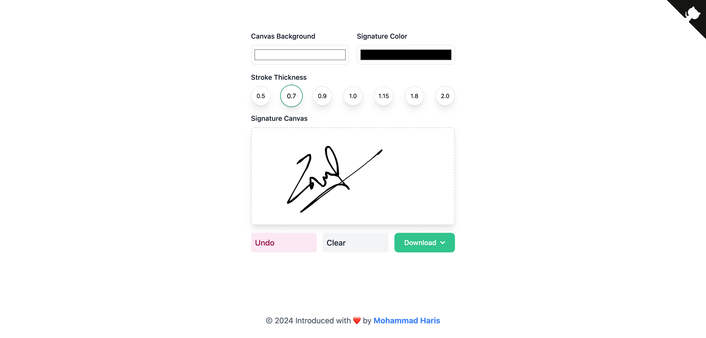

# Digital Signature

## User Interface Snapshot


## Features
- Easily draw a digital signature directly on a canvas.
- Download your signature in JPG, PNG, or SVG format.
- Select from various pencil thickness options to customize your signature.
- Choose the pencil color to draw your signature to match your preference.
- Set a custom background color for the canvas to enhance the visibility of your signature.
- Undo your last action or clear the entire canvas to start over.

## Requirements

- **Node.js**: >=20.14.0
- **npm**: >=10.8.1

Ensure you have the correct versions of Node.js and npm installed. You can download Node.js from [here](https://nodejs.org/) which includes npm.

## Getting Started

Follow these steps to set up and run the project.

### Installation

1. Clone the repository:
    ```bash
    git clone <repository-url>
    cd <repository-directory>
    ```

2. Install the dependencies:
    ```bash
    npm install
    ```


NOTE: If you have `nvm` (Node Version Manager) installed, you can use the following commands to install and use the required Node.js version:

```bash
nvm install
nvm use
```

### Running the Project

To run the project, use the following commands:

1. To start the development server:
    ```bash
    npm run dev
    ```

### Building for Production

To create a production build of the project, use the following command:

```bash
npm run build
